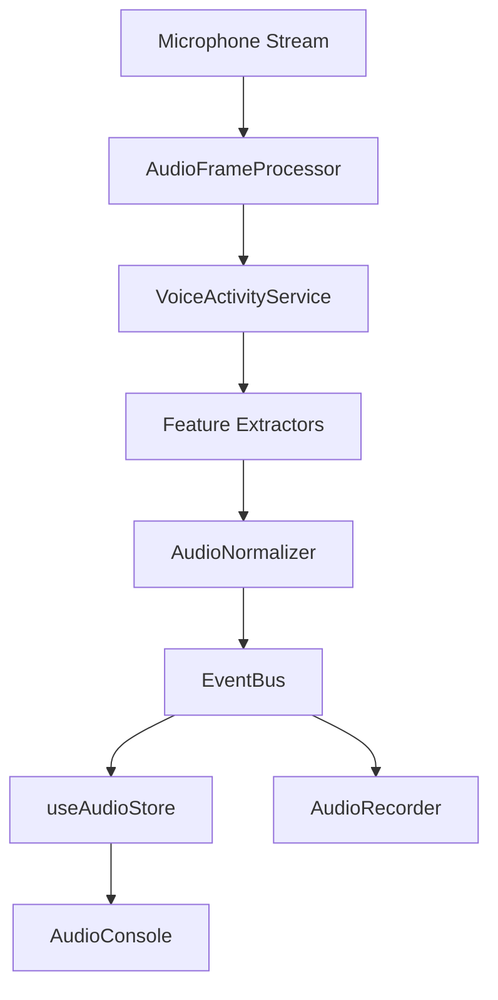

# Audio Analytics Platform (Phase 4)

This document describes the audio pipeline implemented in Phase 4. The platform captures microphone inputs locally, processes volume characteristics using the Web Audio API, estimates speech/silence states, and emits normalized events to the Event Bus.

---

## Architecture Flow

---

## Core Components

1.  **AudioCoordinator**: Orchestrates microphone tracks initialization, `AudioContext` bindings, `AudioFrameProcessor` loop scheduling, and cleanup triggers.
2.  **MicrophoneService**: Manages user device selection, connection streams, and tracks mute/unmute events (`MICROPHONE_MUTED`, `MICROPHONE_DEVICE_CHANGED`).
3.  **AudioFrameProcessor**: Samples inputs at 15–25 times per second using `AnalyserNode`. Calculates root-mean-square (RMS) energy levels, peak values, and frame tracking stats.
4.  **VoiceActivityService**: Evaluates speech activity using volume thresholds and implements onset/hangover timing buffers to stabilize logs against noisy environments.

---

## Feature Extractors

-   **SpeechActivityExtractor**: Evaluates whether active speech occurs.
-   **SilenceExtractor**: Tracks current and historic peak silence intervals.
-   **SpeakingDurationExtractor**: Calculates active speech duration counts.
-   **ResponseLatencyExtractor**: Listens to `QUESTION_CHANGED` events on the Event Bus to measure response latency (elapsed milliseconds before candidate speaks).
-   **AudioLevelExtractor**: Categorizes volume into `LOW`, `NORMAL`, and `HIGH` ranges.
-   **MicrophoneStateExtractor**: Feeds connection/mute states.

---

## Privacy Model

Strict privacy rules are enforced at the Web Audio API layer:
-   **No Waveform Persist**: No raw audio records, WAV/MP3 files, or raw PCM floats/buffer arrays are recorded, saved, or sent.
-   **No NLP/Transcription**: No Speech-To-Text translation or language processing APIs are called, keeping conversations completely confidential.
-   Only derived numerical properties (volume levels, timings) are stored.
