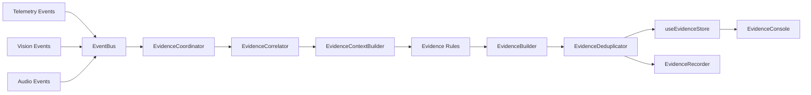

# Evidence Fusion Platform (Phase 5)

This document details the Evidence Fusion Platform reasoning pipeline. The platform listens to events from Telemetry, Vision, and Audio, correlates them in a rolling 30-second window, evaluates context-bound rules, deduplicates repetitive signals, and logs observations.

---

## Architecture Flow

---

## Core Pipeline Stages

1.  **EvidenceCoordinator**: Acts as the Event Bus subscriber. Re-routes events to the correlator and handles mount loops.
2.  **EvidenceCorrelator**: Manages the sliding 30-second history window. Prunes expired inputs, monitors latency metrics, and invokes the rules engine.
3.  **EvidenceContextBuilder**: Maps raw logs in the time window to state objects (current pose, focus state, active faces, response latency) so rules never read state stores directly.
4.  **EvidenceRules**: Decoupled reasoning rules extending the `EvidenceRule` interface. Each evaluates the context and returns observations without side effects.
5.  **EvidenceBuilder**: Generates structured, versioned, non-accusatory `Evidence` objects containing supporting event IDs.
6.  **EvidenceDeduplicator**: Merges consecutive occurrences (e.g. merging several gaze updates) to update active evidence durations instead of flooding logs. Expired types transition to `EXPIRED` status.

---

## Observations Severity Schema

To support objective reasoning without user labeling, severity describes the significance of the event (not candidate guilt):
-   **info**: General info transitions (e.g. settings updates).
-   **low**: Minor deviations (e.g. short response delay).
-   **medium**: Clear state changes (e.g. off-screen attention).
-   **high**: Major deviations (e.g. browser focus loss, multiple faces).
