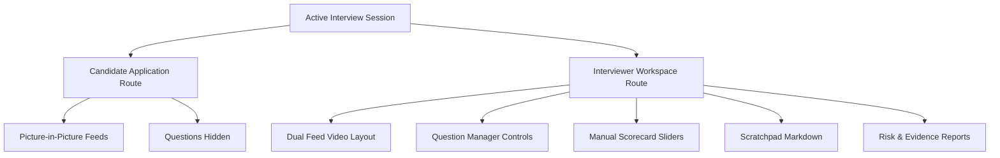

# Interview Collaboration Platform (Phase 7)

This document describes the two-party Interview Collaboration Platform architecture, detailing routes, components, manual evaluation frameworks, and WebRTC integration blueprints.

---

## Workspace Layout Topology

---

## App Router Layout Splits

*   **Candidate Workspace (`candidate/session/[sessionId]`)**: Redesigned to simulate a real video-interview workspace layout (Meet/Zoom style). Renders a large Interviewer stream feed as the main focus alongside a small Picture-in-Picture candidate self-view floating preview. Questions are completely hidden.
*   **Interviewer Workspace (`interviewer/session/[sessionId]`)**: Displays Candidate & Interviewer side-by-side feed windows, question managers, markdown scratchpads, scorecard ratings forms, session telemetry gauges, risk contribution charts, and evidence lists.

---

## Session Synchronization & Question Flow

Questions are completely private to the interviewer to foster natural verbal discussions:
1.  The Interviewer verbally asks the current question shown in their manager workspace.
2.  Interviewer-controlled next/prev actions log questions history and session timeline milestones.
3.  The Candidate participates naturally by listening and replying, without seeing questions on their screen.

---

## Future Blueprints

### WebRTC Streams Integration
To transition from the local webcam to a remote two-way connection:
1.  Instantiate a `RTCPeerConnection` signalling server.
2.  Transmit Candidate video tracks as remote streams.
3.  Mount the remote stream object onto the `<CandidateVideo />` components.

### Authentication Layer
1.  Implement JWT-based access controls.
2.  Assign `candidate` and `interviewer` permissions.
3.  Restrict routes via Next.js Middlewares.
