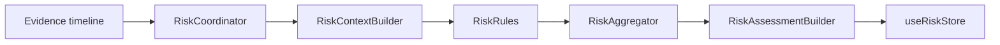

# Explainable Risk Engine (Phase 6)

This document describes the Explainable Risk Engine pipeline. The engine listens to fused Evidence observations, compiles them into a Risk Context, runs independent risk rules, aggregates contributions, and builds transparent assessments.

---

## Architecture Flow

---

## Core Pipeline Stages

1.  **RiskCoordinator**: Listens reactively to `useEvidenceStore` changes. Directs timelines to the evaluation flow.
2.  **RiskContextBuilder**: Groups active and historical evidence events into categories (gaze, focus, presence, responses, audio) so rules do not inspect stores.
3.  **RiskRules**: Evaluates active evidence inputs. Configures weights via `RiskWeights.ts` to output weighted `RiskFactor` nodes.
4.  **RiskAggregator**: Sums risk factor contributions (Weight × Confidence) and maps the score to categorical RiskLevels (`LOW`, `MODERATE`, `HIGH`, `CRITICAL`) using thresholds in `RiskThresholds.ts`.
5.  **RiskAssessmentBuilder**: Produces overall trace assessments with deterministic summary descriptions.

---

## Contribution Model

Risk contribution calculations are completely transparent:
\[\text{Risk Factor Contribution} = \text{Configured Weight} \times \text{Confidence}\]

Overall risk category is mapped using cumulative contributions:
-   **LOW**: 0–24 pts
-   **MODERATE**: 25–49 pts
-   **HIGH**: 50–74 pts
-   **CRITICAL**: 75+ pts
