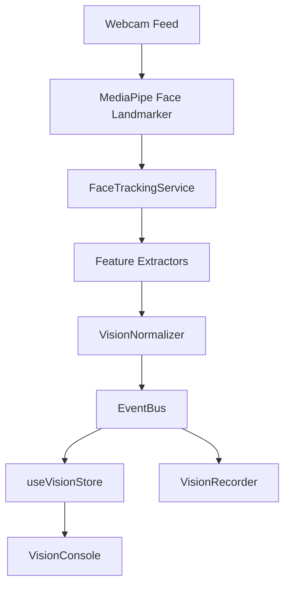

# Vision Analytics Platform (Phase 3)

This document details the vision pipeline implemented in Phase 3. The platform processes camera streams, extracts facial landmark metrics via MediaPipe Face Landmarker, normalizes them, and publishes structured events to the Event Bus.

---

## Architecture Flow

---

## Pipeline Execution Details

1.  **FrameProcessor**: Listens to active video element and schedules frames on `requestAnimationFrame` throttled to 15–20 FPS (~60ms intervals) to prevent thread blockages.
2.  **MediaPipeService**: Dynamically loads `@mediapipe/tasks-vision` and initializes the Face Landmarker model using GPU delegate when available, with automatic CPU fallbacks.
3.  **FaceTrackingService**: Evaluates landmarks presence, tracking counts, and confidence levels, emitting transitions (`FACE_DETECTED`, `FACE_LOST`, `MULTIPLE_FACES`, etc.).
4.  **LandmarkService**: Serves as a short-lived coordinator. It queries independent feature extractors on the raw landmarks and immediately triggers garbage collection (never saving complete landmark coordinates).

---

## Feature Extractors

-   **HeadPoseExtractor**: Calculates Yaw (left/right rotation), Pitch (up/down), and Roll (tilt angle) from 3D landmarker coordinate indices.
-   **EyeGazeExtractor**: Inspects iris center keypoint offset in eye socket coordinates to determine gaze direction (`Left`, `Right`, `Up`, `Down`, `Center`).
-   **BlinkExtractor**: Measures EAR (Eye Aspect Ratio). When EAR drops below the threshold, it triggers blink and increments rolling blink rate logs.
-   **FacePresenceExtractor**: Evaluates present face counts.

---

## Privacy Policies

To align with privacy guidelines:
-   Webcam frames are analyzed locally in memory.
-   No photos, video streams, or screenshot assets are saved, written, or uploaded.
-   Raw landmark arrays are never persisted in the store or filesystem. Only derived mathematical figures are logged.
